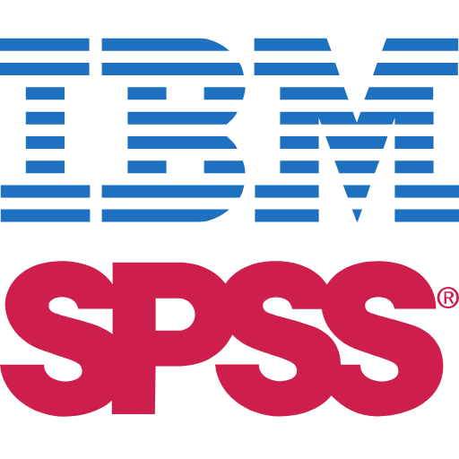
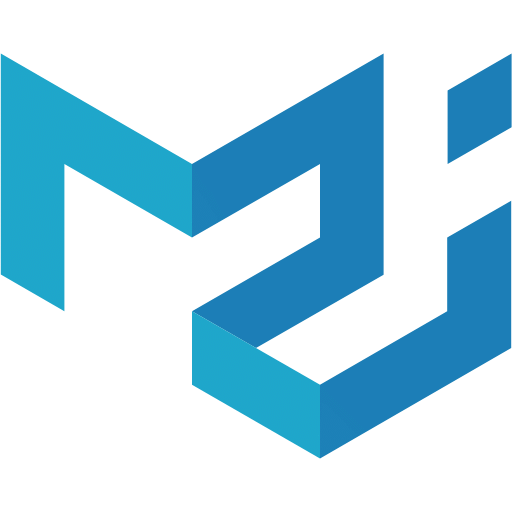
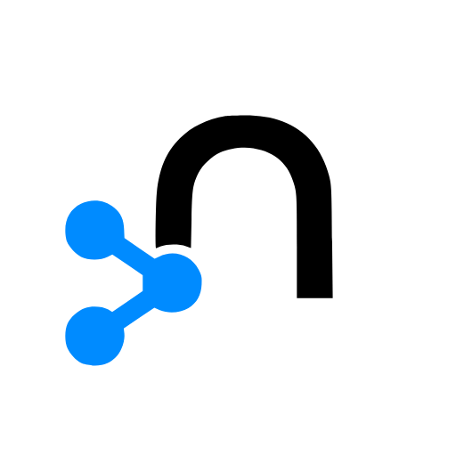
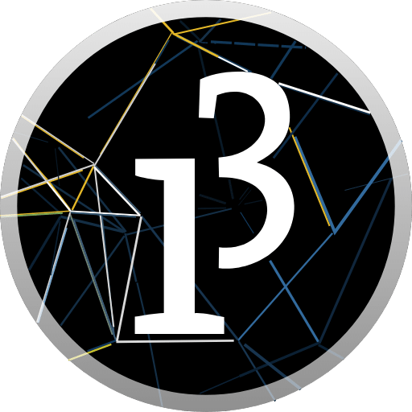
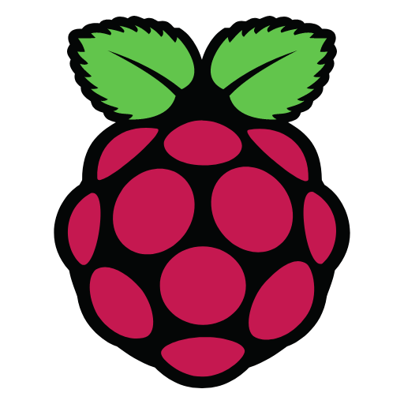
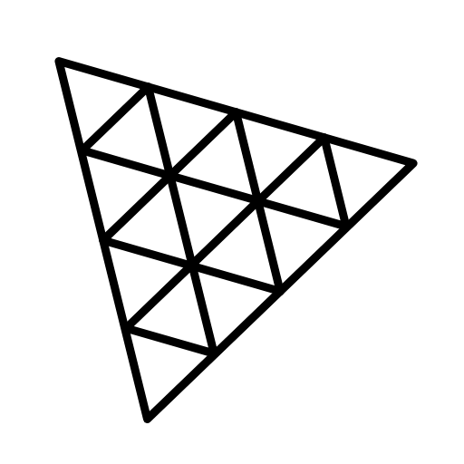
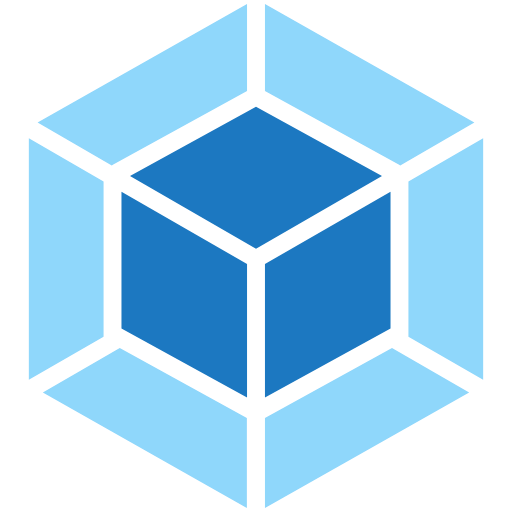

# Devicon PNGs embedded in Markup

#### Icons sourced from <a href="https://github.com/devicons/devicon" class="text-blue-500 underline external" target="_blank">https://github.com/devicons/devicon</a>

*  .NET-core
*  .NET
*  AArch64
*  Adobe-Commerce-(Magneto)
*  Adobe-Illustrator
*  Adobe-Photoshop
*  Adobe-Premiere-Pro
*  Adobe-XD
*  AdonisJS
*  After-Effects
*  Akka
*  Algolia
*  Alpine.js
*  Anaconda
*  Android-Studio
*  Android
*  Angular
*  AngularJS
*  Ansible
*  Ant-Design
*  Apache-Airflow
*  Apache-Cassandra
*  Apache-Groovy
*  Apache-Hadoop
*  Apache-Kafka
*  Apache-Maven
*  Apache-Spark
*  Apache-Subversion
*  Apache-Tomcat
*  Apache
*  APL
*  Appcelerator
*  Apple-Safari
*  Apple
*  Appwrite
*  Arch-Linux
*  Arduino
*  Argo-CD
*  Astro
*  Atom
*  Autodesk-Maya
*  Autodesk-ShotGrid
*  Awk
*  AWS
*  Azios
*  Azure-Devops
*  Azure-SQL-Database
*  Azure
*  Babel
*  Backbone.js
*  Ballerina
*  Bamboo
*  Bash
*  Behance
*  BitBucket
*  Blender
*  Bootstrap
*  Bower
*  BrowserStack
*  Bulma
*  Bun
*  C
*  C#-(CSharp)
*  C++-(CPlusPlus)
*  Cairo-Graphics
*  CakePHP
*  Canva
*  Capacitor
*  CentOS
*  Chrome
*  CircleCI
*  Clarity
*  CLion
*  Clojure
*  ClojureScript
*  Cloudflare-Workers
*  Cloudflare
*  CMake
*  Codeac
*  Codecov
*  CodeIgniter
*  CodePen
*  CoffeeScript
*  Composer
*  Confluence
*  Consul
*  Contao
*  Core-js
*  Cosmos-BD
*  CouchDB
*  Crystal
*  CSS3
*  Cucumber
*  Cypress
*  D3.js
*  Dart
*  DataGrip
*  DataSpell
*  DBeaver
*  Debian
*  Deno
*  Devicon
*  Digital-Ocean
*  Discord.js
*  Django-REST
*  Django
*  Docker
*  Doctrine
*  Dropwizard
*  Drupal
*  Eclipse-Ceylon
*  Eclipse-IDE
*  Eclipse-Vert.x
*  Elastic-Beats
*  Elastic-Search
*  Electron
*  Eleventy-(11ty)
*  Elixir
*  Elm
*  Embedded-C
*  Ember.js
*  Envoy
*  Erlang
*  ESLint
*  Express
*  Facebook
*  FastAPI
*  Fastify
*  Fauna
*  Feathers
*  Fedora
*  Figma
*  FileZilla
*  Firebase
*  Firefox
*  Flask
*  Flutter
*  Fortran
*  Foundation
*  FSharp-(F#)
*  Gatling
*  Gatsby
*  Gazebo
*  GCC
*  Gentoo
*  Ghost
*  GIMP
*  Git
*  GitBook
*  GitHub-Actions
*  GitHub-Codespaces
*  GitHub
*  GitLab
*  Gitpod
*  Gitter
*  GNU-Emacs
*  Go
*  Godot-Engine
*  GoLand
*  Google-Cloud
*  Google
*  Gradle
*  Grafana
*  Grails
*  GraphQL
*  Grunt.js
*  Gulp.js
*  Handlebars
*  Hardhat
*  Harvester
*  HashiCorp-Terraform
*  HashiCorp-Vagrant
*  HashiCorp-Vault
*  Haskell
*  Haxe
*  Helm
*  Heroku
*  Hibernate
*  Homebrew
*  HTML5
*  Hugo
*  IBM-SPSS-Statistics
*  IFTTT
*  InfluxDB
*  Inkscape-
*  Insomnia
*  IntelliJ-IDEA
*  Internet-Explorer-10-(ie10)
*  Ionic
*  Jaeger-Tracing
*  Jamstack
*  Jasmine
*  Java
*  JavaScript
*  Jeet
*  Jekyll
*  Jenkins
*  Jest
*  JetBrains
*  Jira-Align
*  Jira
*  jQuery
*  JSON
*  Jule
*  Julia
*  JUnit
*  Jupyter
*  K3OS
*  K3s
*  Kaggle
*  Karate-Labs
*  Karma
*  Keras
*  Kibana
*  Knex.js
*  Knockout
*  Kotlin
*  Krakenjs
*  Ktor
*  Kubernetes
*  LabVIEW
*  Laravel
*  LaTeX
*  Less.js
*  LinkedIn
*  Linux
*  Liquibase
*  Livewire
*  LLVM
*  Logstash
*  Lua
*  Lumen
*  Markdown
*  Material-UI
*  Materialize
*  MATLAB
*  Matplotlib
*  Meteor.js
*  Microsoft-SQL-Server
*  Minitab
*  MobX
*  Mocha
*  MODX
*  Moleculer
*  MongoDB
*  Mongoose.js
*  Moodle
*  MS-DOS
*  MySQL
*  Nano
*  Nerog
*  Nest.js
*  NetworkX
*  New4j
*  Next.js
*  NGINX
*  NHibernate
*  Nim
*  Nimble
*  NixOS
*  Node.js
*  Nodemon
*  NPM
*  NuGet
*  NumPy
*  Nuxt-JS
*  NW.js-(node-webkit)
*  Objective-C
*  OCaml
*  Oh-my-zsh
*  Okta
*  OpenAL
*  OpenAPI
*  OpenCL
*  OpenCV
*  OpenGL
*  OpenStack
*  openSUSE
*  OpenTelemetry
*  Opera
*  Oracle
*  p5-JS
*  Packer
*  Pandas
*  Perl
*  pfSense
*  Phalcon
*  Phoenix-Framework
*  Photon-Engine-
*  PHP
*  PhpStorm
*  Playwrite
*  Ploty
*  Podman
*  Polygon
*  Portainer
*  PostCSS
*  PostgresSQL
*  Postman
*  Powershell
*  Processing
*  Prometheus
*  Protractor-Test
*  PureScript
*  PuTTY
*  PyCharm
*  PyScript
*  pytest
*  Python-Poetry
*  Python
*  PyTorch
*  Qodana
*  Qt-Framework
*  Quarkus
*  Quasar
*  Qwik
*  R-
*  RabbitMQ
*  Rancher
*  Raspberry-Pi
*  Reach
*  React-Bootstrap
*  React
*  Read-the-Docs
*  Realm
*  Red-Hat
*  RedCube's-epic-Compiler-Thingy-programming-(ReCT)
*  Redis
*  Redux
*  Ren'Py
*  Rider
*  Robot-Operating-System-(ROS)
*  RocksDB
*  Rollup.js
*  RSpec
*  RStudio
*  Ruby-on-Rails
*  Ruby
*  RubyMine
*  Rust
*  Salesforce
*  Sanity
*  Sass
*  Scala
*  Scalingo
*  scikit-learn
*  Selenium
*  Sema-Software
*  Sequelize
*  Shopware
*  Simple-DirectMedia-Layer-(SDL)
*  Sketch
*  Slack
*  Socket.io
*  Solid.js
*  Solidity
*  SonarQube
*  Sourcetree
*  Splunk
*  Spring
*  SQL-Developer
*  SQLAlchemy
*  SQLite
*  SSH
*  Stack-Overflow
*  Stata
*  Storybook
*  Streamlit
*  Stylus
*  Svelte
*  Swagger
*  Swift
*  Symfony
*  Tailwind-CSS
*  Tauri
*  TensorFlow
*  TeX
*  The-Algorithms
*  Three.js
*  Titanium-SDK
*  TortoiseGit
*  Tower
*  Traefik-Mesh
*  Traefik-Proxy
*  Travis-CI
*  Trello
*  Twitter
*  TypeScript
*  TYPO3
*  Ubuntu
*  Unified-Modelling-Language-(UML)
*  Unity
*  UNIX
*  Unreal-Engine
*  uWSGI
*  V8
*  Vala
*  Vercel
*  Veutify
*  Vim
*  Visual-Studio-Code-(VS-Code)
*  Visual-Studio
*  Vite.js
*  Vite
*  vSphere
*  Vue-Storefront
*  Vue.js
*  Vyper
*  WebAssembly
*  Webflow
*  Weblate
*  Webpack
*  WebStorm
*  Windows-11
*  Windows-8
*  WooCommerce
*  WordPress
*  Xamarin
*  Xcode
*  XML
*  YAML
*  Yarn
*  Yii-Framework
*  Yuno-Host
*  Zend-Framework
*  Zig